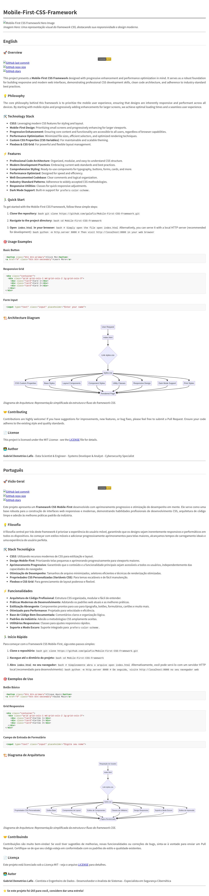

# Mobile-First-CSS-Framework


*Imagem Hero: Uma representação visual do framework CSS, destacando sua responsividade e design moderno.*

---

## English

### 🚀 Overview

[](https://opensource.org/licenses/MIT)
[](https://github.com/galafis/Mobile-First-CSS-Framework/commits/main)
[](https://github.com/galafis/Mobile-First-CSS-Framework)
[](https://github.com/galafis/Mobile-First-CSS-Framework/stargazers)

This project presents a **Mobile-First CSS Framework** designed with progressive enhancement and performance optimization in mind. It serves as a robust foundation for building responsive and modern web interfaces, demonstrating professional CSS development skills, clean code architecture, and adherence to industry-standard best practices.

### 💡 Philosophy

The core philosophy behind this framework is to prioritize the mobile user experience, ensuring that designs are inherently responsive and performant across all devices. By starting with mobile styles and progressively adding enhancements for larger screens, we achieve optimal loading times and a seamless user experience.

### 🛠️ Technology Stack

- **CSS3**: Leveraging modern CSS features for styling and layout.
- **Mobile-First Design**: Prioritizing small screens and progressively enhancing for larger viewports.
- **Progressive Enhancement**: Ensuring core content and functionality are accessible to all users, regardless of browser capabilities.
- **Performance Optimization**: Minimized file sizes, efficient selectors, and optimized rendering techniques.
- **Custom CSS Properties (CSS Variables)**: For maintainable and scalable theming.
- **Flexbox & CSS Grid**: For powerful and flexible layout management.

### ⚡ Features

- **Professional Code Architecture**: Organized, modular, and easy-to-understand CSS structure.
- **Modern Development Practices**: Embracing current web standards and best practices.
- **Comprehensive Styling**: Ready-to-use components for typography, buttons, forms, cards, and more.
- **Performance Optimized**: Designed for speed and efficiency.
- **Well-Documented Codebase**: Clear comments and logical organization.
- **Industry-Standard Patterns**: Adherence to widely accepted CSS methodologies.
- **Responsive Utilities**: Classes for quick responsive adjustments.
- **Dark Mode Support**: Built-in support for `prefers-color-scheme`.

### 🏃‍♂️ Quick Start

To get started with the Mobile-First CSS Framework, follow these simple steps:

1.  **Clone the repository:**
    ```bash
    git clone https://github.com/galafis/Mobile-First-CSS-Framework.git
    ```

2.  **Navigate to the project directory:**
    ```bash
    cd Mobile-First-CSS-Framework
    ```

3.  **Access the demo via GitHub Pages:**
    The live demo is available through GitHub Pages. You can find the link in the repository description or by visiting `https://galafis.github.io/Mobile-First-CSS-Framework/`.

    To run locally, open `docs/index.html` in your browser:
    ```bash
    # Simply open the file
    open docs/index.html
    ```
    Alternatively, you can serve it with a local HTTP server (recommended for development):
    ```bash
    python -m http.server 8000
    # Then visit http://localhost:8000/docs/index.html in your web browser
    ```

### 🎯 Usage Examples

#### Basic Button

```html
<button class="btn btn-primary">Click Me</button>
<a href="#" class="btn btn-secondary">Learn More</a>
```

#### Responsive Grid

```html
<div class="container">
  <div class="grid grid-cols-1 md:grid-cols-2 lg:grid-cols-3">
    <div class="card">Card 1</div>
    <div class="card">Card 2</div>
    <div class="card">Card 3</div>
  </div>
</div>
```

#### Form Input

```html
<input type="text" class="input" placeholder="Enter your name">
```

### 🏗️ Architecture Diagram


*Diagrama de Arquitetura: Representação simplificada da estrutura e fluxo do framework CSS.*

### 🤝 Contributing

Contributions are highly welcome! If you have suggestions for improvements, new features, or bug fixes, please feel free to submit a Pull Request. Ensure your code adheres to the existing style and quality standards.

### 📄 License

This project is licensed under the MIT License - see the [LICENSE](LICENSE) file for details.

### 👨‍💻 Author

**Gabriel Demetrios Lafis**
- Data Scientist & Engineer
- Systems Developer & Analyst
- Cybersecurity Specialist

---

## Português

### 🚀 Visão Geral

[](https://opensource.org/licenses/MIT)
[](https://github.com/galafis/Mobile-First-CSS-Framework/commits/main)
[](https://github.com/galafis/Mobile-First-CSS-Framework)
[](https://github.com/galafis/Mobile-First-CSS-Framework/stargazers)

Este projeto apresenta um **Framework CSS Mobile-First** desenvolvido com aprimoramento progressivo e otimização de desempenho em mente. Ele serve como uma base robusta para a construção de interfaces web responsivas e modernas, demonstrando habilidades profissionais de desenvolvimento CSS, arquitetura de código limpo e adesão às melhores práticas padrão da indústria.

### 💡 Filosofia

A filosofia central por trás deste framework é priorizar a experiência do usuário móvel, garantindo que os designs sejam inerentemente responsivos e performáticos em todos os dispositivos. Ao começar com estilos móveis e adicionar progressivamente aprimoramentos para telas maiores, alcançamos tempos de carregamento ideais e uma experiência de usuário perfeita.

### 🛠️ Stack Tecnológica

- **CSS3**: Utilizando recursos modernos de CSS para estilização e layout.
- **Design Mobile-First**: Priorizando telas pequenas e aprimorando progressivamente para viewports maiores.
- **Aprimoramento Progressivo**: Garantindo que o conteúdo e a funcionalidade principais sejam acessíveis a todos os usuários, independentemente das capacidades do navegador.
- **Otimização de Desempenho**: Tamanhos de arquivo minimizados, seletores eficientes e técnicas de renderização otimizadas.
- **Propriedades CSS Personalizadas (Variáveis CSS)**: Para temas escaláveis e de fácil manutenção.
- **Flexbox e CSS Grid**: Para gerenciamento de layout poderoso e flexível.

### ⚡ Funcionalidades

- **Arquitetura de Código Profissional**: Estrutura CSS organizada, modular e fácil de entender.
- **Práticas Modernas de Desenvolvimento**: Adotando os padrões web atuais e as melhores práticas.
- **Estilização Abrangente**: Componentes prontos para uso para tipografia, botões, formulários, cartões e muito mais.
- **Otimizado para Performance**: Projetado para velocidade e eficiência.
- **Base de Código Bem Documentada**: Comentários claros e organização lógica.
- **Padrões da Indústria**: Adesão a metodologias CSS amplamente aceitas.
- **Utilitários Responsivos**: Classes para ajustes responsivos rápidos.
- **Suporte a Modo Escuro**: Suporte integrado para `prefers-color-scheme`.

### 🏃‍♂️ Início Rápido

Para começar com o Framework CSS Mobile-First, siga estes passos simples:

1.  **Clone o repositório:**
    ```bash
    git clone https://github.com/galafis/Mobile-First-CSS-Framework.git
    ```

2.  **Navegue até o diretório do projeto:**
    ```bash
    cd Mobile-First-CSS-Framework
    ```

3.  **Acesse a demonstração via GitHub Pages:**
    A demonstração ao vivo está disponível através do GitHub Pages. Você pode encontrar o link na descrição do repositório ou visitando `https://galafis.github.io/Mobile-First-CSS-Framework/`.

    Para executar localmente, abra `docs/index.html` no seu navegador:
    ```bash
    # Simplesmente abra o arquivo
    open docs/index.html
    ```
    Alternativamente, você pode servi-lo com um servidor HTTP local (recomendado para desenvolvimento):
    ```bash
    python -m http.server 8000
    # Em seguida, visite http://localhost:8000/docs/index.html no seu navegador web
    ```

### 🎯 Exemplos de Uso

#### Botão Básico

```html
<button class="btn btn-primary">Clique Aqui</button>
<a href="#" class="btn btn-secondary">Saiba Mais</a>
```

#### Grid Responsivo

```html
<div class="container">
  <div class="grid grid-cols-1 md:grid-cols-2 lg:grid-cols-3">
    <div class="card">Cartão 1</div>
    <div class="card">Cartão 2</div>
    <div class="card">Cartão 3</div>
  </div>
</div>
```

#### Campo de Entrada de Formulário

```html
<input type="text" class="input" placeholder="Digite seu nome">
```

### 🏗️ Diagrama de Arquitetura


*Diagrama de Arquitetura: Representação simplificada da estrutura e fluxo do framework CSS.*

### 🤝 Contribuindo

Contribuições são muito bem-vindas! Se você tiver sugestões de melhorias, novas funcionalidades ou correções de bugs, sinta-se à vontade para enviar um Pull Request. Certifique-se de que seu código esteja em conformidade com os padrões de estilo e qualidade existentes.

### 📄 Licença

Este projeto está licenciado sob a Licença MIT - veja o arquivo [LICENSE](LICENSE) para detalhes.

### 👨‍💻 Autor

**Gabriel Demetrios Lafis**
- Cientista e Engenheiro de Dados
- Desenvolvedor e Analista de Sistemas
- Especialista em Segurança Cibernética

---

⭐ **Se este projeto foi útil para você, considere dar uma estrela!**

